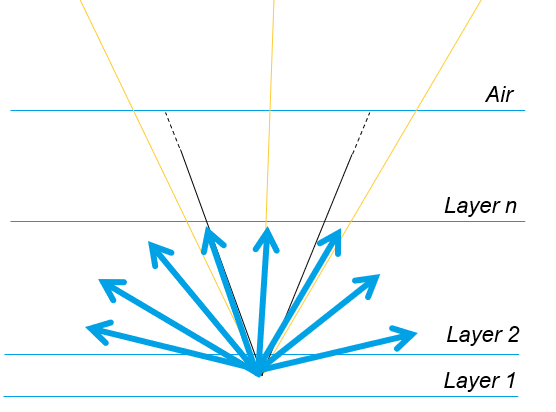

# FDTD / Angle-Resolved & Hemispherical Extraction in a Surface-Textured Optical Stack

> **Ansys Lumerical FDTD** + **Python** pipeline to study escape-cone transmission and the impact of **surface roughness** in an extraction layer. Full-wave results are compared against a **TMM** (Transfer Matrix Method) baseline.

---

## 1) Project Goals

This repository builds a planar multilayer stack, runs an **incidence-angle sweep**, and reports:

- angle-resolved transmittance $T(\theta)$,
- **hemispherical escape** fraction (FDTD and TMM),
- **beyond‑escape‑cone** fraction (light exiting above the critical angle due to roughness/grating effects).

All geometry, source, boundaries, and roughness statistics are provided via a single editable YAML configuration.

---

## 2) Repository Layout

```
scripts/
  build_structure.py    # builds geometry (flat or rough), boundaries, source, monitors + angle sweep
  analyse_results.py    # runs the sweep, fetches T(θ), computes TMM (and optional Fresnel), etc.
app.py                  # orchestrates the pipeline (build → analyze)
configs/params.yaml     # single source of truth (indices, thicknesses, roughness, spans, boundaries, source)
results/                # plots (.png) and logs (.csv)
base.fsp                # base Lumerical project (materials/units) loaded at startup
structure.fsp           # generated FDTD project
```

---

## 3) Requirements & Setup

- **Ansys Lumerical FDTD** v242 (or close)  
- **Python** ≥ 3.9  
- **Lumerical Python API** on `PYTHONPATH` (e.g., `C:\Program Files\Lumerical\v242\api\python`)

#### Install
```bash
pip install -r requirements.txt
```

#### Configure the Lumerical API path via `.env`
```bash
cp .env.example .env
# edit .env to point to the Lumerical API folder
```

---

## 4) Configuration — `configs/params.yaml` (example)

```yaml
# Layers (bottom → top)
layers:
  - name: Layer1
    material: "1.5"       # must exist in base.fsp
    thickness: 0.1e-6

  - name: layer2
    group: true           # true → two-phase surface with nanoparticles
    material: "1.6"       # matrix material
    nanoparticle_material: "1.5"
    thickness: 0.1e-6
    nanoparticle:
      radius: 5e-9
      density: 0.1        # filling factor (10%)

  - name: Layer3
    surface: true         # true → rough surface generated & imported; false → flat rectangle
    material: "1.7"
    thickness: 5e-6
    sigma_rms: 0.07e-6    # RMS roughness height (m)
    corr_length_x: 0.1e-6 # correlation length in x (m)
    corr_length_y: 0.1e-6 # correlation length in y (m)
    seed_process: 6       # random seed for reproducibility
    delta: 0.005e-6       # sampling step of height map Z(x,y) (m)

# Lateral spans (Bloch period in x)
x_thickness: 15e-7        # x period for Bloch; periodizes roughness realization
z_thickness: 10e-9        # unused in 2D

# FDTD region & boundaries (y span is derived from layer sum + buffer)
FDTD:
  dimension: "2D"
  x: 0
  z: 0.0
  x_span: 1e-6
  z_span: 0
  Boundary:
    x_min: "Bloch"
    x_max: "Bloch"
    y_min: "PML"
    y_max: "PML"
    z_min: "PML"
    z_max: "PML"

# Narrowband source (single wavelength)
Source:
  lambda_min: 5e-07
  lambda_max: 5e-07
```


## 5) Running the Pipeline

From the repository root:
```bash
python app.py
```
This will  
1) run `build_structure.py` to create the FDTD model and angle sweep (saving a `.fsp`), then  
2) run `analyse_results.py` to execute the sweep, produce plots, and log metrics.

The scripts can also be run individually:
```bash
python scripts\build_structure.py
python scripts\analyse_results.py
```

**Outputs**
- `results/plots/*.png` — curves $T(\theta)$ (FDTD vs **TMM**; Fresnel optional), $\theta_c$ markers, etc.  
- `results/res.csv` — hemispherical and beyond-cone fractions.  
- `structure.fsp` — generated FDTD project.

---

## 6) Simulation Setup



**Geometry & materials**  
- Layers from YAML (flat or rough top interface with $\sigma_{\mathrm{rms}}$, $L_x=L_y$, $\delta$).  
- Superstrate: air $n=1$.

**Boundaries & mesh**  
- 2D FDTD; **Bloch** in $x$, **PML** in $y$.

**Sources & monitors**  
- **Angle sweep (baseline):** plane wave along $+y$; the top **Y-normal power** monitor in air returns $T(\theta_1)$.

---

## 7) Basic FDTD / sweep-angle theory (not exhaustive)

FDTD solves the time-domain Maxwell equations (iteratively):
```math
\nabla\times \mathbf{E} = -\,\mu\,\frac{\partial \mathbf{H}}{\partial t},\qquad
\nabla\times \mathbf{H} = \varepsilon\,\frac{\partial \mathbf{E}}{\partial t}.
```

Per angle, the top monitor yields the **transmittance per period**:
```math
T_{\mathrm{FDTD}}(\theta_1)=\frac{P_{\mathrm{top}}(\theta_1)}{P_{\mathrm{inc}}(\theta_1)},
```
with energy balance (when converged):
```math
R(\theta_1)+T(\theta_1)+A(\theta_1)=1.
```

**Escape-cone edge:**
```math
\theta_c = \arcsin\!\left(\frac{n_{\mathrm{exit}}}{n_{\mathrm{inc}}}\right) \approx \arcsin\!\left(\frac{1}{\Re\,n_1}\right).
```

---

## 8) Theory baseline used by `analyse_results.py` (STACK / TMM)

The analysis uses Ansys’ **STACK** optical solver (i.e., **TMM**) via `fdtd.stackrt(...)` to compute a multilayer baseline and overlay it on the FDTD sweep.

### 8.1 How inputs are assembled
- **Frequency grid** $f$: if `fmin == fmax`, a single-frequency array; otherwise `linspace(fmin, fmax, 100)`.  
- **Angles** $\theta_{\mathrm{th}}$: `np.arange(0, 81, 1)` (degrees in the incident medium).  
- **Thickness list** `thickness_list`: append `0.0` for the **exit half-space** (semi-infinite).  
- **Refractive indices** `nd_list`: append **air** $n=1+0j$ as the last medium.  
- Build the dispersive index matrix $N \in \mathbb{C}^{(n_\text{layers})\times (n_f)}$ by broadcasting scalars or copying arrays.

### 8.2 Running `stackrt` and extracting $T(\theta)$
```python
RT = fdtd.stackrt(N, thickness_list, f, theta_th)  # returns 'theta','Ts','Tp','lambda',...
theta_th_plot = np.ravel(RT["theta"])
Ts = np.ravel(RT["Ts"])
Tp = np.ravel(RT["Tp"])
Tavg = 0.5 * (Ts + Tp)   # unpolarized average
```

**What TMM includes**  
- **Specular** transmission/reflection and **film interference** (Fabry–Pérot) for planar, laterally uniform stacks.

**What TMM does not include**  
- Scattering from **rough** or **textured** interfaces. Thus, **post‑critical** transmission in FDTD (e.g., grating orders under Bloch) does **not** appear in TMM.

---

## 9) Hemispherical average & beyond-cone metric

### 9.1 Hemispherical outcoupling (escape fraction)

Fraction of the **total isotropic internal emission** (over $4\pi$) that exits through the **front** surface (air). It includes all forward directions $0\le\theta\le\pi/2$.

```math
f_{\mathrm{escape}} = \frac{1}{2}\int_0^{\pi/2} T(\theta)\,\sin\theta\,\cos\theta\,d\theta
```

- The single factor $1/2$ converts from $4\pi$ emission to one surface ($2\pi$).

### 9.2 Beyond‑cone outcoupling

Same integral, but **restricted to angles above the internal critical angle** $ \theta_c=\arcsin(n_{\mathrm{out}}/n_{\mathrm{in}})$. This quantifies escape due to **texture‑enabled momentum conversion** (scattering/diffraction) that circumvents total internal reflection (TIR).

```math
f_{\mathrm{out\,cone}} = \frac{1}{2}\int_{\theta_c}^{\pi/2} T(\theta)\,\sin\theta\,\cos\theta\,d\theta
```

### 9.3 In‑cone contribution

The “geometric” escape inside the TIR cone (including Fresnel transmission):

```math
f_{\mathrm{in\,cone}} = \frac{1}{2}\int_{0}^{\theta_c} T(\theta)\,\sin\theta\,\cos\theta\,d\theta
```

**Additivity:**

```math
\boxed{\,f_{\mathrm{escape}} = f_{\mathrm{in\,cone}} + f_{\mathrm{out\,cone}}\,}
```

**Physical difference.** Hemispherical outcoupling measures everything that exits through the front. Beyond‑cone outcoupling isolates the portion due solely to texture/scattering/diffraction (what a flat interface would not provide).

### 9.4 Why the weight $\sin\theta\cos\theta$?

In 3D, an isotropic field has constant radiance. More rays arrive at shallow polar angles because there are many azimuths around the ring at that $\theta$ (factor $\sin\theta$), and each ray contributes less flux through the plane the more tilted it is (projection factor $\cos\theta$). The product $\sin\theta\cos\theta$ is therefore the correct flux weighting at polar angle $\theta$. A 2D angular sweep provides $T(\theta)$ along one azimuthal cut; weighting by $\sin\theta\cos\theta$ reproduces the 3D hemispherical flux average provided $T$ is approximately azimuth‑independent (or averaged over azimuth).

### 9.5 Truncating the sweep at 80° (robust near grazing)

Data stop at $80^\circ$ (to avoid artifacts near $90^\circ$):
```math
f^{(\le 80^\circ)} = \frac{1}{2}\int_0^{80^\circ} T(\theta)\,\sin\theta\,\cos\theta\,d\theta.
```

The missing tail ($80^\circ\to90^\circ$) obeys a rigorous bound since $0\le T\le 1$:
```math
0\le\Delta\le\frac{1}{2}\int_{80^\circ}^{90^\circ}\sin\theta\,\cos\theta\,d\theta
=\frac{1}{4}\cos^2 80^\circ
\approx \frac{0.03015}{4}
\approx 0.754\% \text{ absolute (of total emission).}
```

**Optional tiny tail correction** (freeze $T$ at $80^\circ$):
```math
\hat f = f^{(\le 80^\circ)} + \frac{1}{4}\,T(80^\circ)\,\cos^2 80^\circ.
```

Since $\cos^2 80^\circ\approx 0.03015$, this adds at most about $0.754\%$ absolute when $T(80^\circ)=1$. In most textured stacks $T(\theta>80^\circ)\approx 0$, so the correction is typically omitted.

### 9.6 What `analyse_results.py` computes

```python
# --- FDTD (uses the actual sweep angles 'theta') ---
T_sim_frac = _to_fraction(transmission)   # power transmittance in [0,1]

# --- TMM/STACK (uses 'theta_th_plot') ---
T_tmm_frac = _to_fraction(Tavg)

# angles in degrees in your arrays; build radian versions for integration
rad = np.radians(theta)           # FDTD angles
rad_t = np.radians(theta_th_plot) # TMM angles

cos_sim = np.cos(rad);  sin_sim = np.sin(rad)
cos_t   = np.cos(rad_t); sin_t   = np.sin(rad_t)

# --- FDTD: hemispherical escape fraction (one front surface) ---
outcoupling_fdtd = 0.5 * simpson(T_sim_frac * cos_sim * sin_sim, x=rad)

# beyond-cone (θ > θc): scattering/diffraction-assisted escape.
mask_out_fdtd = theta > theta_c
outcone_fdtd = (0.5 * simpson(T_sim_frac[mask_out_fdtd] *
                              cos_sim[mask_out_fdtd] *
                              sin_sim[mask_out_fdtd],
                              x=rad[mask_out_fdtd])
               ) if np.any(mask_out_fdtd) else 0.0

# --- TMM/STACK: same formulas ---
outcoupling_tmm = 0.5 * simpson(T_tmm_frac * cos_t * sin_t, x=rad_t)

mask_out_tmm = theta_th_plot > theta_c
outcone_tmm = (0.5 * simpson(T_tmm_frac[mask_out_tmm] *
                             cos_t[mask_out_tmm] *
                             sin_t[mask_out_tmm],
                             x=rad_t[mask_out_tmm])
              ) if np.any(mask_out_tmm) else 0.0

# Optional tail correction (usually omitted)
# cos2_tail = np.cos(np.radians(80.0))**2
# outcoupling_fdtd_hat = outcoupling_fdtd + 0.25 * T_sim_frac[-1] * cos2_tail
# outcoupling_tmm_hat  = outcoupling_tmm  + 0.25 * T_tmm_frac[-1]  * cos2_tail
```

---

## 10) Roughness parameters (from YAML) and their use

```yaml
- name: Layer1
  surface: true/false
  material: "1.7"
  thickness: 5e-6
  sigma_rms: 0.07e-6
  corr_length_x: 0.1e-6
  corr_length_y: 0.1e-6
  seed_process: 6
  delta: 0.005e-6
```

| Key | Meaning | Used when |
|---|---|---|
| `name` | Layer label | Always (object naming) |
| `surface` | `false` → flat rectangle; `true` → rough surface via `sroughness` + surface import | Selects build branch |
| `material` | Material name/id (FDTD uses this database entry) | Geometry |
| `thickness` | Film thickness (m). For flat: `y` span; for imported: extrusion | Geometry |
| `sigma_rms` | RMS height (m) of roughness | Only if `surface: true` |
| `corr_length_x/y` | Correlation lengths (m) | Only if `surface: true` |
| `seed_process` | Random seed for reproducibility | Only if `surface: true` |
| `delta` | Sampling step (m) of height map $Z(x,y)$ | Only if `surface: true` |

**Modeling notes.** The generated surface is periodic over the chosen span; with Bloch in $x$ the model behaves like a **grating** (discrete diffraction orders). For diffuse studies, switch to **PML in $x$**, enlarge the span $\gg L$, and average several seeds.

**Practical tips** (rule of thumb, not official limits).

- Start with a surface sampling step $\Delta$ that resolves both the roughness and the fields:

```math
  \Delta \;\lesssim\; \min\!\Big\{\,L/6,\ \sigma_{\rm rms}/3,\ \lambda/(10\,n_{\max})\,\Big\}.
```
Then decrease $\Delta$ until results change by $<\,1\text{–}2\%$.

- Add a **mesh override** near the rough interface; target $\gtrsim 10$ points per wavelength in the highest-index region (tighten if phase accuracy is critical).

- Check **convergence/energy balance** per angle:
```math
R(\theta)+T(\theta)+A(\theta)\;\approx\;1,
```
  and confirm the curves are stable under further mesh/sampling refinement.

- For near-grazing incidence, increase **PML thickness/strength** (and optionally add a larger air spacer) to suppress spurious reflections.

---

## 11) References (Ansys documentation & related)

- Bloch boundary conditions in FDTD and MODE — Ansys Optics Help  
  https://optics.ansys.com/hc/en-us/articles/360034382714-Bloch-boundary-conditions-in-FDTD-and-MODE  
- Periodic boundary conditions in FDTD and MODE — Ansys Optics Help  
  https://optics.ansys.com/hc/en-us/articles/360034382734-Periodic-boundary-conditions-in-FDTD-and-MODE  
- Understanding injection angles in broadband simulations  
  https://optics.ansys.com/hc/en-us/articles/360034382894-Understanding-injection-angles-in-broadband-simulations  
- PML boundary conditions in FDTD and MODE  
  https://optics.ansys.com/hc/en-us/articles/360034382674-PML-boundary-conditions-in-FDTD-and-MODE  
- Far-field projections in FDTD — overview  
  https://optics.ansys.com/hc/en-us/articles/360034914713-Far-field-projections-in-FDTD-overview  
- Far-field from a box of monitors  
  https://optics.ansys.com/hc/en-us/articles/360034915613-Far-field-projections-from-a-box-of-monitors  
- TFSF source — tips & best practices  
  https://optics.ansys.com/hc/en-us/articles/360034382934-Tips-and-best-practices-when-using-the-FDTD-TFSF-source  
- TFSF source — simulation object  
  https://optics.ansys.com/hc/en-us/articles/360034902093-Total-Field-Scattered-Field-TFSF-source-Simulation-object  
- `sroughness` — script command (Gaussian-correlated rough surface)  
  https://optics.ansys.com/hc/en-us/articles/360034926193-sroughness-Script-command  
- Grating projections in FDTD — overview  
  https://optics.ansys.com/hc/en-us/articles/360034394354-Grating-projections-in-FDTD-overview  
- `gratingangle` / `gratingpolar` — script commands  
  https://optics.ansys.com/hc/en-us/articles/360034927273-gratingangle-Script-command  
  https://optics.ansys.com/hc/en-us/articles/360034407034-gratingpolar-Script-command  
- STACK optical solver (TMM) — overview  
  https://optics.ansys.com/hc/en-us/articles/360034914653-STACK-Optical-Solver-Overview  
- `stackrt` — script command (TMM R/T)  
  https://optics.ansys.com/hc/en-us/articles/360034406254-stackrt-Script-command

---

## 12) Citation

- **Citation**: Please cite **Ansys Lumerical FDTD** and this repository if these results are used.
